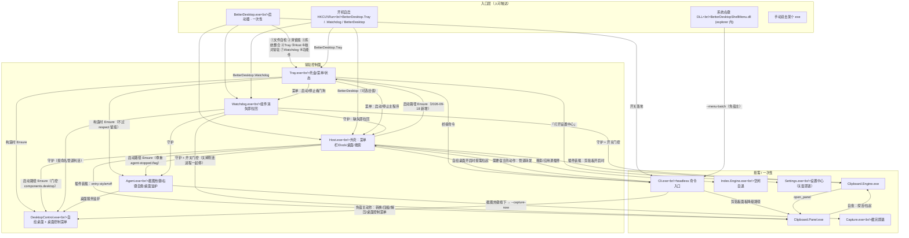

# BetterDesktop 入口 ↔ 组件/功能 关系图

> 目的：**避免把"入口"和"功能"搞混**。同一个功能，从不同入口进来，被拉起的进程集合是不一样的；
> 反过来，同一个进程可能由好几个入口拉起。历史上多次误判（"Host 起来了但功能没起来"、"托盘不在"、
> "右键点了没反应"）都源于没区分这两件事。
>
> 本文所有箭头都带证据行（`文件:行号`），可直接核对。基线：2026-09-18。
>
> **2026-09-20 目录重组**：文中的 `host/`、`launcher/`、`tray/`、`updater/`、`recovery/`、`BetterDesktop.Cli/`、`watchdog/` 等路径前缀均已并入 `packages/entry/`（如 `host/Bootstrap.cs` → `packages/entry/host/Bootstrap.cs`；`watchdog/` 已退役删除）。本文为过渡期快照，路径行保留原样以反映当时的真实布局。
>
> ⚠ **本文是"过渡期现状图"，不是终态。** 2026-09-19 起架构已换代：目标态是
> **只有 `core`（Rust）常驻、其余按需拉起**，生命周期所有者收敛为 `core` + `launcher` 两处。
> 本文描述的这套"多入口互相 Ensure"的网状结构**正在被拆掉**（拆解进度见
> [`2026-09-20-current-architecture.md`](2026-09-20-current-architecture.md)）：托盘与看门狗被 core 取代（S3/S5）、
> Agent 被删（S4-4）、Host 的三条 Ensure 被删（S6）。**S6 落地后本文必须重画。**

---

## 1. 三种"启动世界"

用户其实只有三种方式让这套东西跑起来，**它们拉起的组件集合差别很大**：

| # | 方式 | 拉起的组件 | 说明 |
|---|---|---|---|
| ① | 双击 **`BetterDesktop.exe`（启动器）** | 全部该起的（托盘 / 主程序 / 常驻服务 / 看门狗…）+ 自检修复 + 让你选开关 | **2026-09-18 新增**，一次性，跑完即退 |
| ② | **开机自启**（`HKCU\...\Run`） | 由自启值决定：`BetterDesktop.Tray`、`BetterDesktop.Watchdog`（+ 可选的旧值 `BetterDesktop`） | 由 `Cli --system-integration register` 写入 |
| ③ | **单独双击某个 exe**（或原生右键菜单/CLI 触发某个动作） | 只起来"那一个 + 它自己负责拉起的" | 最容易误判的一条 |

> ③ 是理解全部困惑的钥匙：**每个 exe 只保证"自己 + 自己职责内的兄弟"**，
> 不保证整套世界完整（见 §3 的"谁拉起谁"）。

---

## 2. 哪些是"入口"、哪些只是"内部组件"

| 类别 | 程序 | 人需要点它吗 |
|---|---|---|
| **用户入口**（人点得动） | `BetterDesktop.exe`（启动器）、`BetterDesktop.Tray.exe`（托盘）、`BetterDesktop.Settings.exe`（设置中心）、`BetterDesktop.Cli.exe`（命令行）、`BetterDesktop.Recovery.exe`（应急恢复） | 是 |
| **被拉起的常驻组件** | `BetterDesktop.Host.exe`（外壳）、`BetterDesktop.Agent.exe`（能力宿主）、`BetterDesktop.DesktopControl.exe`（桌面服务）、`BetterDesktop.Watchdog.exe`（看门狗） | 否（一般不用手点） |
| **按需/一次性组件** | `BetterDesktop.Clipboard.Panel.exe`（面板）、`BetterDesktop.Clipboard.Engine.exe`（剪贴板引擎）、`BetterDesktop.Capture.exe`（截图，截完即退）、`BetterDesktop.Index.Engine.exe`（索引，空闲自退） | 否 |
| **非 exe 入口** | `native\BetterDesktopShellMenu.dll`（explorer 进程内的系统右键扩展）、自绘菜单/Dock/菜单栏（Host 进程内 UI） | 是（右键/点击） |

---

## 3. 全图：谁拉起谁



### 纯文本版（没用 Mermaid 渲染器时看这个）

```
BetterDesktop.exe(启动器) ─┬─> Tray ──┬─> Agent ──(热键)──> Capture(一次性)
                           │          ├─> DesktopControl
                           │          ├─> Host（菜单项）
                           │          ├─> Watchdog（菜单项）
                           │          └─> Settings（菜单项）
                           ├─> Host ──┬─> DesktopControl（components.desktop=true）
                           │          ├─> Agent（未被显式停止时）
                           │          ├─> Tray（2026-09-18 新增）
                           │          ├─> Clipboard.Engine（剪贴板开启时）
                           │          ├─> Clipboard.Panel（entry-style≠off）
                           │          └─> Index.Engine（搜索按需）
                           └─> Watchdog ─┬─> Host / Agent
                                         ├─> Clipboard.Panel / Clipboard.Engine（开关门控）
                                         └─> DesktopControl（管道判活）

开机自启(Run 值) ──> Tray / Watchdog /（可选）Host

系统右键 DLL ──> Cli --menu-batch ──┬─> Host（需要宿主时：管道转发）
                                    └─> 免宿主直做（转换/压缩/解压/桌面控制菜单）

Clipboard.Panel <──自愈/拉起──> Clipboard.Engine
```

---

## 4. 入口职责矩阵（每行的证据）

| 入口 | 它**负责**拉起 | 它**不负责** | 证据 |
|---|---|---|---|
| `BetterDesktop.exe` 启动器 | 托盘 → 主程序 → 核对 Agent/桌面服务 → 看门狗 → 功能件核对；并做系统整合自检/修复、清"停止"留痕、按用户选择落地开关 | 不做更新、不做卸载 | `launcher/Services/ComponentBootstrapper.cs:69-78`（八步顺序）、`:84-96`（必需文件清单） |
| `BetterDesktop.Tray.exe` | **Agent + 桌面服务**（构造时即做）；菜单里可启停主程序/看门狗/Agent/桌面服务 | 不守护别人（它自己也不被守护） | `tray/TrayApplicationContext.cs:96-97` → `:921` `EnsureAgentAutoStart()`、`:950` `EnsureDesktopServiceAutoStart()`；`tray/ProcessBridge.cs:46/78`(Host) `:127/147`(Agent) `:192/212`(桌面服务) `:268/285`(看门狗) |
| `BetterDesktop.Host.exe` | 插件装载（菜单栏/Dock/桌面/搜索/剪贴板…）；启动路径还要 Ensure：**桌面服务**（门控 `components.desktop`）、**Agent**（尊重 `agent-stopped.flag`）、**Tray**（2026-09-18 新增，不设复活抑制）；剪贴板插件装载时 Ensure 引擎 + 面板入口 | 不守护任何进程（守护是看门狗的事） | `host/Bootstrap.cs:351`(桌面服务) `:354`(Agent) `:357`(Tray)；`packages/shell/shell-clipboard/ClipboardPlugin.cs:103`(EnsureEngine) `:138`(EnsurePanelEntry) |
| `BetterDesktop.Watchdog.exe` | 守护 **Host / Agent / Clipboard.Panel / Clipboard.Engine / DesktopControl**：进程消失即拉回；剪贴板两项受开关门控且"关掉连进程一起停"；桌面服务按**命名管道**判活 | **不守护** Tray、Capture、Index.Engine（有意：后两者是"按需+空闲自退"，守护会与退场打架） | `watchdog/Program.cs:159-176`（守护清单）`:110`(StopWhenDisabled) `:122`(UsePipeLiveness) `:95`(`watchdog-pause.flag` 全局暂停) `:164-175`（为何不守护索引/截图） |
| `BetterDesktop.Agent.exe` | 截图热键 → 按下时以 `--capture-now` 拉起 `Capture.exe`（截完即退）；系统右键扩展自愈；桌面服务监护 | 不持有 Dock/菜单栏等 UI | `agent/Capabilities/CaptureHotkeyOwner.cs:285`(`--capture-now`)`:107`（受 `extensions.screenshot.enabled` 门控，关掉交还热键） |
| `BetterDesktop.DesktopControl.exe` | 自绘桌面、桌面控制菜单；**它是 `shellmenu.json` 快照的唯一写入者** | 不拉起别人 | `packages/shell/shell-desktop/.../DesktopPlugin.cs`（ApplyShellMenuRegistration）；由 Host/看门狗/CLI 拉起 |
| `BetterDesktop.Cli.exe` | 免宿主动作直接做：格式转换 / 压缩 / 解压 / 弹「桌面控制」菜单 / **开关翻转**；需要宿主的动作（剪贴板历史、打开设置、dock-pin）→ 命名管道转发给 Host；`--system-integration status/register/unregister/repair` | 不建 WPF 窗口（纪律：CLI 绝不起 Dispatcher） | `BetterDesktop.Cli/HeadlessExecutor.cs`（`Classify`/`ClassifyBatch`）、`packages/kernel/kernel/MenuCommandPipeClient.cs:20`（`TrySend`，1.5s 连接超时） |
| `BetterDesktop.Settings.exe` | 设置中心（独立进程，不依赖宿主，关窗即退） | 不拉起组件（除设置项自身的重启动作） | `tray/AppPaths.cs:99-103` 注释（为此专门独立出来的原因） |
| `BetterDesktop.Recovery.exe` | 反向操作：显示原生任务栏 + **终止** Host/Watchdog/Tray/DesktopControl/Agent；可选 `--clean-autostart` 清 Run 值 | 不清剪贴板面板/截图（用户可能正在用） | `recovery/Program.cs:29-36`(终止名单) `:41`(Run 值名单) |
| **系统右键 DLL** | 读 `shellmenu.json` 渲染 → 派发 `Cli --menu-batch` | 不含业务逻辑（薄壳） | `packages/shell/shell-context-menu/native/*`（"只做读配置→渲染→派发"） |
| **开机自启** | 按 Run 值拉起 Tray / Watchdog /（旧值）Host | —— | `packages/kernel/kernel/Deployment/AutostartRegistrar.cs:31/34/37`（三个值名）；写入者 `SystemIntegrationRegistrar.cs:158`(Tray, required) `:165`(Watchdog)；设置页开关 `shell-settings` 的 `SystemManagement.cs:39/103` |

---

## 5. 反查表：每个组件"谁拉起 / 谁停 / 死了谁救"

| 组件 | 谁拉起 | 谁能停 | 被停后的留痕 | 死了谁救 |
|---|---|---|---|---|
| **Host** | 托盘菜单、启动器、看门狗、CLI（自绘桌面开启时）、开机自启（旧值 `BetterDesktop`） | 托盘「停止主程序」 | `host-stopped.flag` | **看门狗** |
| **Agent** | 托盘（构造时）、Host（启动路径）、看门狗、更新器 | 托盘「停止常驻服务」 | `agent-stopped.flag` | 看门狗（**尊重留痕**，不复活） |
| **Tray** | 开机自启、启动器、Host | 托盘「退出」（只隐藏图标+退出线程） | **无留痕** | **没人救**（看门狗不守护它）——刻意设计 |
| **Watchdog** | 开机自启、托盘菜单、启动器、更新器 | 托盘「停止看门狗」/ Recovery | `watchdog-pause.flag`（应急暂停而非退出） | 没人救 |
| **DesktopControl** | Host（`components.desktop=true`）、看门狗、CLI 按需弹菜单 | 托盘「停止桌面服务」/ 关掉 `components.desktop` | `desktop-stopped.flag` | 看门狗（管道判活） |
| **Clipboard.Engine / Panel** | 剪贴板插件（`extensions.clipboard-history.enabled=true`）、看门狗；面板还会自愈引擎 | 关掉 `extensions.clipboard-history.enabled`（插件 `StopAll` + 看门狗 `StopWhenDisabled`） | 无（开关即真相） | 看门狗 |
| **Capture** | Agent 热键（`--capture-now`）、CLI/托盘按需 | 自己截完就退 | —— | **没人守护**（有意） |
| **Index.Engine** | 搜索/应用源按需（`IndexEngineLauncher.EnsureEngine`） | 空闲 600s 自退；或关掉 `extensions.index.enabled`（下次不再拉起） | —— | **没人守护**（有意） |
| **Settings** | 托盘、开始菜单 | 关窗即退 | —— | —— |

---

## 6. 功能开关 → 谁消费 → 怎么生效

> 这是最容易和"入口"混淆的一层。**开关不拉起进程，它只改"下次要不要"或"让正在跑的那个自己动"**。

| 开关键 | 消费方 | 生效方式 |
|---|---|---|
| `components.desktop` | 桌面服务进程内的插件（订阅 `SettingsChanged`）+ Host 启动路径 + 看门狗门控 | 实时（进程内建/停桌面层）；Host 侧只在启动时读一次 |
| `extensions.clipboard-history.enabled` | 剪贴板插件（`SettingsChanged` → 起/停 引擎+面板） | 实时（进程级）；2026-09-18 起改为**线程池串行**执行，不再卡 UI 线程 |
| `hotkeys-panel.enabled` / `island.enabled` / `components.menubar` / `components.dock` | 各自插件（订阅 `SettingsChanged`） | 实时（进程内拆窗/建窗） |
| `extensions.index.enabled` | `IndexEngineLauncher.IsEnabledBySettings()`（**每次拉起前扫 `settings.json`**） | **下次按需拉起时**；已在跑的不受影响 |
| `extensions.screenshot.enabled` | Agent 的 `CaptureHotkeyOwner`（关掉即**交还热键**） | 热键接管状态实时变化；`Capture.exe` 本就按需拉起 |
| 菜单栏系统功能（托盘/CPU/内存/音量/时间/搜索…） | `MenuBarStatusStrip`（取目录 `DefaultEnabled` + 持久化显隐） | 纯 UI 折叠，实时 |

---

## 7. 本次（2026-09-18）新增的两条箭头

这两条正是此前"功能没起来"的缺口，画进图里以免再混淆：

1. **`Host → Tray`**（`host/Bootstrap.cs:357` 起）：以前只有托盘能把托盘自己带起来，
   而 README 把"直接启动 `Host.exe`"列为合法入口 → 走那条路时任务栏没有托盘图标、托盘菜单全部无从触达。
2. **`BetterDesktop.exe`（启动器）→ 全部**：以前"装完第一次"由安装脚本代劳，之后没人负责"把整套世界拉齐"。

同时修正了一条既有的错误认知：**"Host 不拉起别的组件"** 已不成立 ——
Host 现在会 Ensure 桌面服务、Agent、Tray。三者的"复活抑制"并不相同，别混为一谈：

| Host 补拉的组件 | 是否尊重"用户显式停止" | 为什么 |
|---|---|---|
| 桌面服务 | 是（`desktop-stopped.flag`） | 用户可以在托盘里显式停止它 |
| Agent | 是（`agent-stopped.flag`） | 同上，托盘菜单有「停止常驻服务」 |
| 托盘 | **否**（无抑制） | 托盘的「退出」只隐藏图标+退出线程、**不写任何留痕文件**，没有可尊重的标记；而"用户主动启动宿主"本身就意味着要一个完整可用的外壳 |

---

## 8. 只想验证某个功能时，从哪进最省事

| 想验证 | 最省事的入口 | 注意 |
|---|---|---|
| 整套是否可用 | **双击 `BetterDesktop.exe`** | 它会逐条报"哪一步成/败"，跑完即退 |
| 托盘菜单是否完整 | 双击 `BetterDesktop.Tray.exe` | Win11 新图标默认在「^」溢出区 |
| 剪贴板（面板/热键/侧边手柄） | 托盘菜单 →「打开剪贴板历史」 | 面板 exe 必须在**安装根**（本批已修打包） |
| 系统右键菜单 | 右键任意文件 → 「BetterDesktop」 | 用 `Cli --system-integration status` 取证（见审计文档 §12.3） |
| 自绘桌面 / 桌面控制 | 右键桌面 →「桌面控制」 | 它会拉起 `DesktopControl.exe`（按需） |
| 设置中心 | 托盘菜单 →「打开设置中心」 | 独立进程，关窗即退 |
| 出大事了（任务栏乱/图标层错乱） | `BetterDesktop.Recovery.exe` | 它会**终止** Host/Watchdog/Tray/桌面服务/Agent |

---

## 9. 维护约定（改这张图的条件）

**只要改动以下任一处，就必须同步更新本文件**：

- 任何 exe 新增/删除，或改了 `AssemblyName`；
- 任何 `Ensure*` 调用点（Host/托盘/启动器/更新器）；
- 看门狗的守护清单（`watchdog/Program.cs` 的 `BuildTargets`）或门控键；
- 开机自启的值名（`AutostartRegistrar` 的三个常量）；
- 任何一个功能开关的**消费方**或生效方式（§6 表）。
